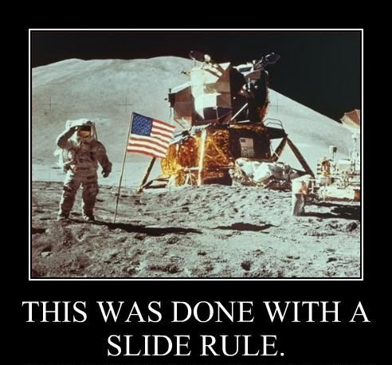

# Motivation

## Standing on the shoulders of giants
* "If I have seen farther than others, it is because I was standing on the shoulders of giants." - Isaac Newton 
* "If I have not seen as far as others, it is because giants were standing on my shoulders." - Hal Abelson 
* "In computer science, we stand on each other's feet." - Brian Reid
* "How many people can stand on the shoulders of a giant before the giant collapses?" - znmeb

## We program today in a rich environment
* numerous abstract programming paradigms,
* elegant realizations of those paradigms in programming languages,
* well-crafted run-times, interpreters and compilers,
* distributed version control systems for collaboration,
* integrated development environments, and
* documentation tools.

## Programming paradigms
* Object-oriented programming
    - Simula67 (1967)
    - Smalltalk 80 (1980)
* Functional programming
    - OCaml (1996)
    - Haskell (1990)
* Array programming
    - Matlab (1984)
    - S (1976)
    - R (1994)
    - APL (1966)

## What made all this possible?
* Transistor logic
* Magnetic core random access memory
* General-purpose architectures like System\\360 (1964)

## And before that?
* Two kinds of computers - "scientific" and "business"
* Two languages - FORTRAN and COBOL

## May 25, 1961 - July 20, 1969
[John F. Kennedy's Moon Speech to Congress - May 25, 1961](https://youtu.be/Kza-iTe2100)

## \<rant\>



## Like Hell It Was!
* By July of 1969, large System\\360 mainframes were in use at NASA
* Even in 1961, the state of the art was an IBM 7090
* \</rant\>

## What was your first computer?

## Did you learn assembler?

## Did you learn machine code?

# John von Neumann

## In Europe

## The Manhattan Project

## Game Theory

## Self-reproducing systems / cellular automata

## Applied Mathematics

## Bureaucrat

## Death

# The IAS Machines

## State of scientific computing

## Preliminary discussions

## Planning and coding

## Hardware
* MANIAC
* JOHNNIAC
* ILLIAC and copies

## Commercial variants
* IBM 701
* Univac 1100

# The architecture

## Arithmetic unit

```{r echo = FALSE}
DiagrammeR::grViz("arith_unit.gv")
```

## The accumulator (A) and quotient register (Q) coupled

```{r echo = FALSE}
DiagrammeR::grViz("aq.gv")
```

## Left Shifting = multiply AQ by two
1. Shift a0 -> bit bucket
2. Shift a1:a39 -> a0:a38
3. Leave q0 alone!
4. Shift q1 -> a39
5. Shift q2:q39 -> q1:q38
6. Zero -> q39

## Right Shifting = divide AQ by two
1. Shift q39 -> bit bucket
2. Shift q1:q38 -> q2:q39
3. Leave q0 alone!
4. Shift a39 -> q1
5. Shift a0:a38 -> a1:a39
6. Keep original a0!

## Adding
1. Augend
    * Clear A, or
    * Hold A, or
    * Set A = 1/2
2. Addend
    * Memory word or Q to R3, then
3. Complement gate
    * Pass straight through, or
    * Negate, or
    * Absolute value
3. Form sum in A

## Multiplication: initialization
1. Multiplier is in Q
2. Multiplicand is in R3
3. Accumulator
    * Clear A, or
    * Hold A, or
    * Set A = 1/2
4. Complement gate
    * Pass straight through, or
    * Negate, or
    * Absolute value

## Multiplication: iteration
39 steps of

* A <- A + Complement gate
* Shift AQ right one bit

## Dividing
1. Double-length dividend in AQ
2. Divisor is in R3
3. 39 steps of
    * subtract R3 from A in the adder
    * if the result is less than zero, set q39 to 0
    * if the result is greater than or equal to zero, set q39 to 1 and copy the difference to A
    * shift AQ left one place, copying q1 into q0
4. Set q39 to 1 for rounding

## Control

## Input / Output

# The software engineering process

## Algorithms
* Calculus / differential equations
* Statistics / Monte Carlo
* Linear algebra / linear equations / eigensystems

## Memory layout

## Assembler / loader

## Run

## Debugging / post-mortem

# The emulator

## Existing emulators
* simh
* SILLIAC
* misc

## Why build a new one?

